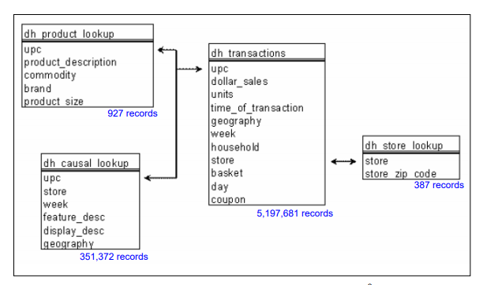

## **Big Data Integration Final** {.tabset .tabset-fade .tabset-pills}
**Authors: Sidney Schaeper, Aman Rastogi, Keya Satpathy, Bhawna Saini, Prathiba Swamykannu**

### Initial Questions for the Project
#### **Initial Questions for Our Evaluation**
The following are the intital questions we thought we could answer with our data sources: 

* Should we continue to do business with our five worst performing brands based on the perspective of customers?
* Does location of the product within the store and ad impact sales of the product? What is the optimal location within the store and ads?
* What amounts of each product should we plan to have in inventory on average daily based on these sales?  

We thought the first question would be insightful to the business, because a company should know what customers think of the brands they partner with. A company likely wouldn't want to work with a brand that has a bad image to its customers, because they likely wouldn't sell many of the products associated with that brand. In addition, we considered the second question to be a great question to answer, because we thought this could help Kroger's marketing strategy. The marketing strategy would be improved with this knowledge, because the marketers would have more knowledge of the optimal locations for high product sales in the weekly ad and stores. The final question would be great for a busines to know, because this knowledge would help improve a company's inventory strategy. This strategy would improve, because you possibly could improve your inventory prediction levels for each store from using the data instead of just guessing. 

### Tools Used
Tools that we used were basically R packages which include resuable R functions. They come in really handy for complex data analysis as ours.

The packages that we used are: \
1. **readr** - to read files into R \
2. **dplyr** - for data wrangling and manipulation \
3. **tidyr** - for data cleaning \
4. **shiny** - for creating interactive reports \
5. **DT** - to include DataTables \
6. **ggplot2** - for fancy visualizations \
7. **plotly** - for interactive plots and graphs \

```{r eval = FALSE}
#Packages that needed to be installed for the project#
install.packages("readr")
install.packages("dplyr")
install.packages("tidyr")
install.packages("shiny")
install.packages("DT")
install.packages("ggplot2")
install.packages("plotly")
install.packages("tidyverse")
install.packages("tm")
install.packages("ggwordcloud")
install.packages("tidyr")
```

```{r results = "hide", warning = FALSE, message = FALSE}
#Packages that need to be found for the project#
library(readr)
library(dplyr)
library(tidyr)
library(shiny)
library(DT)
library(ggplot2)
library(plotly)
library(tidyverse)
library(tm)
library(ggwordcloud)
library(tidyr)
```

### Data Sources
#### **84.51 Data Source**
The data that we wanted to evaluate for this project came from two sources. The first source was from [84.51's website](https://www.8451.com/). The folder of data that we used from 84.51 are called the Carbo Loading datasets. There are a total of four datasets within this folder. The four datasets are called the casual_lookup, product_lookup, store_lookup, and transactions. According to the Carbo Loading guide provided, these datasets came from a relational database. Also, these datasets contain purchases at a household level over two years, and the datasets are filtered to only contain products from four categories. These four categories are pasta, pasta sauce, syrup, and pancake mix. In addition, the guide contained information pertaining to the variables within each of the datasets. The tables below show these variables and their description.
Below is the overall view of the table:


**Transactions Dataset Table**

Variable | Description 
---------|------------
upc | It is a standard 10 digit code assigned to products. This is the product that was purchased.
dollar_sales | The amount of money spent on this product by the customer. These are recorded in dollars.
units | The quantity of this product purchased. 
time_of_transaction | The time the transaction occurred. This is recorded in military time. 
geography | This label tells you where it was purchased out of the two large regions. These two regions consist of multiple states. The value can either be 1 or 2. 
week | This notifies the week that the transaction occured. The range of values is from 1 to 104. These numbers are assigned chronologically. 
household | This value is a unique number assigned to a household. This is the purchaser of the product.
store | This value is a unique number assigned to each store. This is where the product was purchased.
basket | This is a unique number assigned to a trip to the store. This is the trip that this product was assigned to. 
day | This is the day that this product was purchased. The range of values is 1 to 728. 
coupon | This is dummy variable to notify whether a coupon was used. The possible value is 1 or 0. 1 means a coupon was used. 0 means a coupon wasn't used. 


**Store Lookup Dataset Table**

Variable | Description 
---------|------------
store | This value is a unique number assigned to each store.
store_zip_code | This is the 5 digit zip code for the store. 

**Product Lookup Dataset Table**

Variable | Description
---------|------------
upc | This is the standard 10 digit code assigned to this product. 
product_description | This details the product. This likely contains the name of the product.
commodity | This is the category of the product. The four possibly values are pasta, pasta sauce, pancake mix, or syrup. 
brand | This is the brand name of the product. 
product_size | This is the size of the product. These aren't all in the same measurement. 

**Casual Lookup Dataset Table**

Variable | Description
---------|------------
upc | This is the standard 10 digit code assigned to this product. 
store | This value is a unique number assigned to each store.
week | This notifies the week that the transaction occured. The range of values is from 1 to 104. These numbers are assigned chronologically. 
feature_desc | This is where the product is located on the weekly ad. 
display_desc | This is where the product is displayed in the store. 
geography | This label tells you where it was purchased out of the two large regions. These two regions consist of multiple states. The value can either be 1 or 2. 

```{r eval = TRUE, results = "hide", fig.show = "hide", message = FALSE, warning = FALSE}
#Set the working directory#
#setwd("~/8451_Carbo-Loading/Carbo-Loading CSV")
setwd("E:/UC Study Material/Spring 2020/Flex 3/BDI/8451_Carbo-Loading/Carbo-Loading CSV")
#Read the datasets into R#
causal <- read_csv("causal_lookup.csv")
transaction <- read_csv("transactions.csv")
product <-read_csv("product_lookup.csv")
store <- read_csv("store_lookup.csv")
```

```{r}
#See a partial view of the casual_lookup dataset#
datatable(head(causal))

#See a partial view of the transactions dataset#
datatable(head(transaction))

#See a partial view of the product lookup dataset#
datatable(head(product))

#See a partial view of the store lookup dataset#
datatable(head(store))
```

#### **Twitter Data Source**
The final source of data we used for our projet was from [Twitter](http://apps.twitter.com). We had to create a developer account in order to get access to these tweets. In this project, we were hoping to pull this data manually to get customer opinions about brands. The way we pulled these tweets down manually was through using the search tweets package in R, and we searched through twitter to find these tweets by searching on the brand name and the food category of the brand. Next, we cleaned these results by focusing just on the tweet, removing emojis, removing urls, lowering the case of the tweets, removing the punctation, removing the numbers, removing stop words, removing white space, and removing additional words that we don't want to evaluate. After we cleaned the tweets, we separated the tweets into words, counted these words, and filtered on the top 10 words. After collecting these results, we created a data frame from all these results. If a brand and category didn't show a result, we put NA for these word results. Below is a table of the dataset we created manually, and this table shows the variables and description. 

```{r eval = FALSE}
#The below is an example of the code we wrote for each brand in order to get this twitter data. We had to alternate the brand name and commodity for each run of the twitter data#
#Barilla Tweets#
barilla <- c("barilla", "pasta")
barilla_search <- paste(barilla, collapse = " AND ")
barilla_tweets <- search_tweets(q = barilla_search, n = 1000, lang = "en", include_rts = FALSE)
tibble(barilla_tweets)

head(barilla_tweets$text)

barilla_text <- barilla_tweets$text

corpus_barilla <- Corpus(VectorSource(barilla_tweets$text))

barilla_emoji_clean <- tm_map(corpus_barilla, content_transformer(gsub), pattern = "\\W", replace = " ")

remove_urls <- function(x) gsub("http[^[:space:]]*", "", x)

url_clean_barilla<- tm_map(barilla_emoji_clean, content_transformer(remove_urls))

lower_barilla <- tm_map(url_clean_barilla, content_transformer(tolower))

remove_items <- function(x) gsub("[^[:alpha:][:space:]]*", "", x)
remove_barilla <- tm_map(lower_barilla, content_transformer(remove_items))

remove_punct_barilla <- tm_map(remove_barilla, removePunctuation)

remove_num_barilla <- tm_map(remove_punct_barilla, removeNumbers)

remove_stop_barilla <- tm_map(remove_num_barilla, removeWords, stopwords("english"))

remove_white_barilla <- tm_map(remove_stop_barilla, stripWhitespace)

remove_words_barilla <- tm_map(remove_white_barilla, removeWords, c("barilla", "barillas", "cbarilla", "amp", "pasta", "pastas"))

matrix_barilla <- TermDocumentMatrix((remove_words_barilla))
matrix_barilla_2 <- as.matrix(matrix_barilla)
sort_barilla <- sort(rowSums(matrix_barilla_2), decreasing = TRUE)
data_frame_barilla <- data.frame(word = names(sort_barilla), freq = sort_barilla)

top_10_barilla <- data_frame_barilla %>%
  arrange(desc(freq)) %>% head(10)

barilla_final <- crossing(top_10_barilla, brand = "Barilla")
barilla_final

#After we found this data, we combined the datasets together that had tweets that showed up. The code we used is below#
twitter_data <- rbind(miller_final, barilla_final, golden_eagle_final, rr_final, alaga_final, creamette_final, bisquick_final, hungry_jack_final, kraft_final, dececco_final, eden_final, pomi_final, hunts_final, vita_final, mothers_final, mueller_final, la_moderna_final, aunt_jemima_final, tree_of_life_final, ronzoni_final, san_giorgio_final, ragu_final, bertolli_final, davinci_final, kellogg_final, colavita_final, san_marzano_final, classico_final, krusteaz_final, pioneer_final, buitoni_final, mrs_butterworth_final, raos_final, karo_final, prego_final, joeys_final, smuckers_final, daves_final, brothers_final, orzo_final, howards_final, knotts_final, hodgson_mills_final, amore_final, no_yolks_final, rf_final, hse_final, maple_grove_final, lyles_final, eddie_final, northwoods_final, al_dente_final, cucina_final, silver_palate_final, quinoa_final, m_c_final, rac_final, moms_final, sinatras_final)

#After we finished combining the datasets, we saved the dataset as a csv file. The code is below for how we saved this dataset#
write.csv(twitter_data, "twitter_data.csv")
```

```{r}
#This is the code we used to read the dataset into R#
#Set the working directory#
#setwd("~/8451_Carbo-Loading/Carbo-Loading CSV")
setwd("E:/UC Study Material/Spring 2020/Flex 3/BDI/8451_Carbo-Loading/Carbo-Loading CSV")
#Read the dataset into R#
twitter_data <- read_csv("twitter_data.csv")
#See a preview of the dataset#
datatable(head(twitter_data))
```

**Twitter Dataset Table**

Variable | Description 
---------|------------
word | These are the words that showed up in the top 10 filter.
freq | These are the counts of the word showing up in the tweets.
brand | This is the name of the brand.

##### **Zip Data Source**

We have used Zip code from "US Zip Code Latitude and Longitude" to create our plotly map. The 84.51 datasets didn't have longitude and latitude, and we needed this in order to create our map. 


**Zip Dataset Table**

Variable | Description
---------|------------
zip| A unique 5 digit number. This is the zip code. 
city| This is the city of this zip code. 
state|This is the state of this zip code
latitude| This is the latitude of this zip code.
longitude| This is the longitude of this zip code. 
timezone| This is the timezone of this zip code. 
daylight savings time flag | This notifies whether this zip has a daylight savings time flag.
geopoint| This is the geopoint of this zip.


```{r eval = TRUE, results = "hide", fig.show = "hide", message = FALSE, warning = FALSE}
#Set the working directory#
#setwd("~/8451_Carbo-Loading/Carbo-Loading CSV")
setwd("E:/UC Study Material/Spring 2020/Flex 3/BDI/8451_Carbo-Loading/Carbo-Loading CSV")
#Read the zip dataset into R#
zip <- read_csv("zip.csv")
```

```{r}
#See a partial view of the dataset#
datatable(head(zip))
```

### Data Integration Process
#### Schema Alignment 
At the initial stages of your big data analysis, you're not going to possess the identical level of control over data definitions as you are doing together with your operational data. However, once you have got identified the patterns that are most relevant to your business, you wish the potential to map data elements to a standard definition. That common definition is then carried forward into operational data, data warehouses, reporting, and business processes.

The traditional approach of schema alignment consists of three main steps - creating a mediated schema, attribute matching and schema mapping. First, a mediated schema is created by unifying the schemas of the data sources being integrated. Queries to the data integration system are formulated on this mediated schema. Next is the attribute matching step which specifies how attribute values from different schemas are to be matched for equality in the mediated schema. In many cases the attribute correspondence is one-to-one however, sometimes one attribute may correspond to a combination of several attributes in the source schema. The last stage is the Schema Mapping which is built between each source schema and the mediated schema. The problem of establishing associations between data under different schemas is at the core of many data integration and data sharing tasks.

#### Record Linkage 
After creating a mediated schema by integrating different sources, we observe that different sources provide value for the same attribute of the same entity. These values may often differ due to mistyping, multiple naming conventions and so on. For instance, the column for date of birth can be named as ‘birth date’ in one schema and ‘dob’ in the other. These representational differences make it hard to link such similar records even though they refer to the same entity. Record linkage attempts to link such millions of records obtained from tens to thousands of data sources.

The process of record linkage starts with pairwise matching where a pair of records are compared to make a local decision of whether they refer to the same entity or not. But often this local decision making may not be globally consistent.

#### Data Fusion
Often while combining data from different sources to create a mediated data schema, we find that such different sources provide conflicting values for the same attribute of the same entity. These conflicts can arise because of mistyping, miscalculations or out of date information which has not been updated consistently across all the databases. For instance, let us consider that the takeoff time for a flight has changed starting January 2020 but this information has not been updated across all the databases which contains information about this flight. This leads to conflicting information which can be confusing and also under certain circumstances, harmful. Data fusion attempts at combining such records that refer to the same real-world entity into a single representation by resolving possible conflicts from different data sources.


```{r}
#Transformations of the datasets#
#Clean the files before the inner join for Question 2#
causal_select <- causal %>%
  select(upc, store, week, feature_desc, display_desc)
transaction_clean <- transaction %>%
  filter(week > 42) %>%
  select(upc, dollar_sales, units, week, store)

#Make some transformations of the data for Question 3#
product_transform <- transform(product, upc = as.character(upc))
store_transform <- transform(store, store_zip_code = as.character(store_zip_code))
names(store_transform)[2] <- "Zip"
zip_transform <- transform(zip, Zip = as.character(Zip))

#Select the columns needed from each of the datasets for Question 3#
transaction_select <- transaction %>%
  select(upc, units, week, store, day)
product_select <- product_transform %>%
  select(upc, product_description)
store_select <- store_transform %>%
  select(store, Zip)
```

```{r}
#First Inner Join for Question 1#
prod_trans <- inner_join(transaction, product_transform, by = c("upc"))
datatable(head(prod_trans))
```

```{r}
#Group by brand to show the sum of sales for Question 1#
prod_trans_group <- prod_trans %>%
  group_by(brand, commodity) %>%
  summarise(brand_total_sales = sum(dollar_sales, na.rm = TRUE)) %>%
  arrange(brand_total_sales)
```

```{r}
#Second Inner Join for Question 1#
#Left join on group data and twitter data#
prod_trans_group_twitter <- left_join(prod_trans_group, twitter_data, by = "brand")
datatable(head(prod_trans_group_twitter))
```

```{r}
#Inner join for Question 2#
causal_trans <- inner_join(causal_select, transaction_clean, by = c("upc", "store", "week"))
datatable(head(causal_trans))
```

```{r}
#Inner join on all these datasets for Question 3#
transaction_product <- inner_join(transaction_select, product_select, by = "upc")
datatable(head(transaction_product))  
transaction_product_store <- inner_join(transaction_product, store_select, by = "store")
datatable(head(transaction_product_store))
```

```{r}
#Additional inner join for question 3 for creating the zip code map#
#Group the data by zip code and the sum the quanity of products sold in these zip codes#
zip_map_data_2 <- transaction_product_store %>%
  group_by(Zip) %>%
  summarise(Total_Quantity_Zip = sum(units, na.rm = TRUE))

#Inner join on zip and transaction product store#
transaction_product_store_zip <- inner_join(zip_map_data_2, zip_transform, by = "Zip")
datatable(head(transaction_product_store_zip))
```

### Results 
###Conclusion for Data Integration in Carbon-Loading datasets
For the datasets we have used, we have not encountered much issues with schema alignment, record linkage and record linkage. This is primarily since the source of our datasets is uniform. We have received all the four datasets used in our analysis from 8451. So, our datasets were clean and homogeneous. Only our zip dataset was in csv format while the other three were in excel. This would have required some work on schema alignment had we not used a powerful analysis tool like R which can read and analysis data in different formats like excel and csv without any additional efforts being made.

```{r}
#Question 1 Editing and Results#
#Top 5 worst performing brands overall#
datatable(head(prod_trans_group, 5))
#Top 5 Worst performing brands for pasta#
prod_trans_group_pasta <- prod_trans_group %>%
  filter(commodity == "pasta") %>%
  arrange(brand_total_sales)
datatable(head(prod_trans_group_pasta, 5))
#Top 5 Worst performing brands for pasta sauce#
prod_trans_group_pasta_sauce <- prod_trans_group %>%
  filter(commodity == "pasta sauce") %>%
  arrange(brand_total_sales)
datatable(head(prod_trans_group_pasta_sauce, 5))
#Top 5 Worst performing brands for syrups#
prod_trans_group_syrups <- prod_trans_group %>%
  filter(commodity == "syrups") %>%
  arrange(brand_total_sales)
datatable(head(prod_trans_group_syrups, 5))
#Top 5 Worst performing brands for pancake mixes#
prod_trans_group_pancake_mixes <- prod_trans_group %>%
  filter(commodity == "pancake mixes") %>%
  arrange(brand_total_sales)
datatable(head(prod_trans_group_pancake_mixes, 5))

#Shiny app for word cloud of twitter data for Question 1#
shinyApp(
  ui = fluidPage(selectInput("brand", "Select the brand you want to evaluate:", choices = sort(unique(prod_trans_group_twitter$brand)), multiple = FALSE), plotOutput("word", height = 300, width = 700)),
  server = function(input, output) {selected_data_tab <- reactive({req(input$brand)
    prod_trans_group_twitter %>%
      dplyr::filter(brand %in% input$brand)})
  output$word <- renderPlot({
    ggplot(selected_data_tab(), aes(label = word, size = freq)) +
      geom_text_wordcloud_area() +
      scale_size_area(max_size = 24) +
      theme_minimal()+
      labs(title = "Word Cloud: Top 10 Word Associated with This Brand", 
           subtitle = "The larger the word the higher the frequency. If nothing shows up, this means that there were no tweets about this brand.")
  })},
options = list(height = 500))

```

```{r}
#Editing of the Combined Dataset to Find the Answers for Question 2#
#Feature Description for Sales#
causal_trans_feature_dollar <- causal_trans %>%
  select(feature_desc, dollar_sales)%>%
  group_by(feature_desc) %>%
  summarise(Total_Dollar_Sales = sum(dollar_sales, na.rm = TRUE)) %>%
  arrange(desc(Total_Dollar_Sales))
datatable(causal_trans_feature_dollar)
#Feature Description for Units#
causal_trans_feature_units <- causal_trans %>%
  select(feature_desc, units)%>%
  group_by(feature_desc) %>%
  summarise(Total_Units = sum(units, na.rm = TRUE)) %>%
  arrange(desc(Total_Units))
datatable(causal_trans_feature_units)
#Feature Description Sales divided by Units (aka average price)#
causal_trans_feature_units_dollar <- causal_trans %>%
  select(feature_desc, units, dollar_sales)%>%
  group_by(feature_desc) %>%
  summarise(Sales_Divided_By_Units = sum(dollar_sales, na.rm = TRUE)/sum(units, na.rm = TRUE)) %>%
  arrange(desc(Sales_Divided_By_Units))
datatable(causal_trans_feature_units_dollar)

#Display_desc sales#
causal_trans_display_dollar <- causal_trans %>%
  select(display_desc, dollar_sales)%>%
  group_by(display_desc) %>%
  summarise(Total_Dollar_Sales = sum(dollar_sales, na.rm = TRUE)) %>%
  arrange(desc(Total_Dollar_Sales))
datatable(causal_trans_display_dollar)
#Display_desc units sold#
causal_trans_display_units <- causal_trans %>%
  select(display_desc, units)%>%
  group_by(display_desc) %>%
  summarise(Total_Units = sum(units, na.rm = TRUE)) %>%
  arrange(desc(Total_Units))
datatable(causal_trans_display_units)
#Display_desc sales divided by units (aka average price)#
causal_trans_display_units_dollar <- causal_trans %>%
  select(display_desc, units, dollar_sales)%>%
  group_by(display_desc) %>%
  summarise(Sales_Divided_By_Units = sum(dollar_sales, na.rm = TRUE)/sum(units, na.rm = TRUE)) %>%
  arrange(desc(Sales_Divided_By_Units))
datatable(causal_trans_display_units_dollar)
```

```{r}
#Code to get Answers for Question 3#
#Part 1#
#Group the data by product and find the top 5 products sold by quantity#
product_total_top_5 <-transaction_product_store %>%
  group_by(product_description) %>%
  summarise(Sum_Quantity = sum(units, na.rm = TRUE)) %>%
  arrange(desc(Sum_Quantity)) %>%
  head(5)
datatable(product_total_top_5)

#Part 2#
#Group the data by day and product description and create a calculation to sum the units by day#
combine_day_sum <- transaction_product_store %>%
  group_by(day, product_description) %>%
  summarise(Sum_Quantity_by_Day = sum(units, na.rm = TRUE))


#Shiny table for presentation to allow a user to see how much quanity of a product was bought each day#
shinyApp(
  ui = fluidPage(selectInput("day", "Select the day you want to evaluate:", 
                             choices = sort(unique(combine_day_sum$day)), multiple = TRUE),
                 selectInput("product_description", "Select the product you want to evaluate:",
                             choices = sort(unique(combine_day_sum$product_description)), multiple = TRUE), 
                 DT::dataTableOutput('tbl')), 
                 server = function(input, output) {selected_data_tab <- reactive({
                   req(input$day)
                   req(input$product_description)
                   combine_day_sum %>%
                     dplyr::filter(day %in% input$day & product_description %in% input$product_description)})
                 output$tbl = DT::renderDataTable(
                   selected_data_tab(), options = list(lengthChange = FALSE), 
                                                  caption = 
                     "This table shows the quantity of each product by day that could possibly be planned for inventory.")},
                 options = list(height = 400))

#Part 3#
#Group the data by day, sum the units of the day, and arrange it by day#
combine_day_time <- transaction_product_store %>%
  group_by(day) %>%
  summarise(Total_Quantity_Day = sum(units, na.rm = TRUE)) %>%
  arrange(day)
#Preview the dataset#
datatable(head(combine_day_time))

#Find the top 5 days when products were sold#
top_5_days <- combine_day_time %>%
  arrange(desc(Total_Quantity_Day)) %>%
  head(5)
datatable(top_5_days)

#Create a line graph showing the quantity sold over time#
ggplot(data = combine_day_time, aes(x = day, y = Total_Quantity_Day, group=1)) +
  geom_line() +
  geom_point() +
  ggtitle("Quantity Over Time", subtitle = "This shows the quantity over all the days recorded in the dataset.")

#Part 4#
#Select the columns we need for the zip data and arrange it in descending order by Total Quanity Sold#
zip_map_data <- transaction_product_store_zip %>%
  select(Zip, Latitude, Longitude, Total_Quantity_Zip) %>%
  arrange(desc(Total_Quantity_Zip))
#Shows the top 5 Zips for Total Quantity Sold#
datatable(head(zip_map_data, 5))

#Making the map to see where the most products are sold by zip code#
#styling the map#
g <- list(
  scope = 'usa',
  projection = list(type = 'albers usa'),
  showland = TRUE,
  landcolor = toRGB("gray95"),
  subunitcolor = toRGB("gray85"),
  countrycolor = toRGB("gray85"),
  countrywidth = 0.5,
  subunitwidth = 0.5
)

map <- plot_geo(zip_map_data, lat = ~Latitude, lon = ~Longitude)
map <- map %>% add_markers(
  text = ~paste(paste("Zip Code:", Zip), paste("Units:", Total_Quantity_Zip), sep = "<br />"),
  color = ~Total_Quantity_Zip, symbol = I("circle"), size = I(8), hoverinfo = "text"
)
map <- map %>% colorbar(title = "Total Units Sold")
map <- map %>% layout(
  title = 'Total Units Sold by Zip<br /> (Hover over the circle to see the units sold and zip)', geo = g)

map
```


### Lessons Learned 

Doing this analysis on the 84.51 data was really insightful. We had the opportunity to learn a lot about new tools and packages in R. Using these packages, we were able to create tidy tables, handle large datasets, and do text mining on data. We were also able to learn more about Kroger's business. The products they use, the amount they stock, the best selling and worst selling products, the overall success of the company were all visible through this data. We were able to identify the most successful products and brands that were most preferred by the consumers. With this inference, Kroger can focus more on the consumer likes and tweak its stock according to that.  

### Issues Encountered

The following issues that we had encountered are:
1. The first issue we had encountered was on deciding the scope for the project. We had planned on doing an association mining for the products we have considered for our datasets but this did not turn out to be a great success since we do not have much experience in prescriptive analysis. 
2. Initially we had planned to work on the entire dataset but as we proceeded, we noticed that the dataset consists of many irrelevant columns which were not of much use to our analysis. Deciding on the optimum number of columns to use for our analysis took us much time in the beginning.
3. The unstructured data which we had used for our project was from [Twitter](http://apps.twitter.com). We had to create a developer account in order to get access to these tweets. This process was quite time consuming. Further, doing text mining on the dataset was also a complex job and we encountered several issues as we did it.
4. We also felt that R was not as efficient as other big data analysis tools like Hadoop for very large datasets like the one we had initially considered for our analysis. It needed a lot of joins and other aggregation techniques to merge the datasets to come up with the expected analysis. We think it would have been easier to visualize and analyze the data had we used the key-value and map reduce concept in Hadoop.

### Possible Future Steps

In the future, we intend to study if there is any interaction between related products like pasta and pasta sauce and syrup and pancake mix and determine if there is actually any association between the sale of these products. We shall also study if placing similar products together actually increases the sale of either of the products. For instance, we expect that putting pasta and pasta sauce together will logically result in increased sale for both the products rather than putting pasta and syrup together.

We also want to do an association analysis between brands for such related products like do people who buy Pasta Sauce of Brand X also buys Pasta of Brand Y along with it. In such cases, we will be able to come up with better product placement and ad ideas.

### Bibliography
"Exporting a dataset from R"
http://www.instantr.com/2012/12/11/exporting-a-dataset-from-r/
"Scatter Plots on Maps in R"
https://plot.ly/r/scatter-plots-on-maps/
"US Zip Code Latitude and Longitude"
https://public.opendatasoft.com/explore/dataset/us-zip-code-latitude-and-longitude/export/
"R - Add a new column to the data frame and duplicate the existing rows"
https://stackoverflow.com/questions/48217301/r-add-a-new-column-to-the-data-frame-and-duplicate-the-existing-rows
"Text Mining Twitter Data With TidyText in R"
https://www.earthdatascience.org/courses/earth-analytics/get-data-using-apis/text-mining-twitter-data-intro-r/
"Text mining: Twitter extraction and stepwise guide to generate a word cloud"
https://towardsdatascience.com/text-mining-twitter-extraction-and-stepwise-guide-to-generate-a-word-cloud-a2c9d626008d
"Carbo-Loading: A Relational Database"
https://www.8451.com/area51
"Search Tweets"
https://developer.twitter.com/en/docs